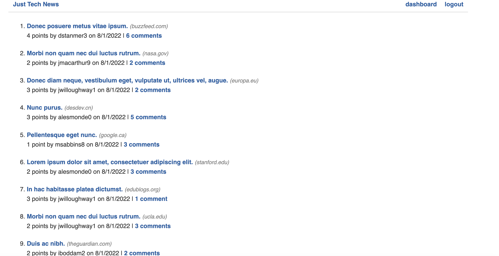
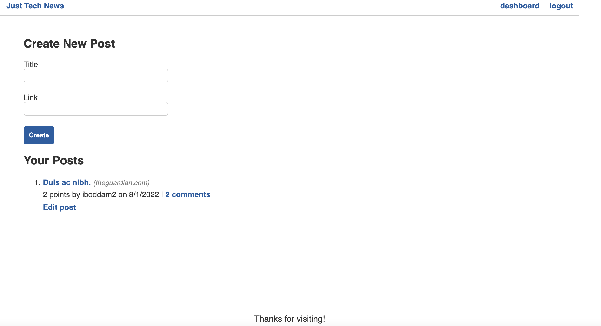

# just-tech-news

### This app will be used as a blog style posting site, where users can login securely and post, comment or upvote posts on the site.
### as a secured logged in user, you can create new posts, edit your posts or delete them. You can also see other users posts and make comments or upvote their posts

### badges

## Table of Contents

- [installation](#installation)
- [contribution guidelines](#contribution)
- [Test Instructions](#testing)
- [License](#license)
- [Questions](#questions)

### Installation
You can use the following by cloning the github repository and running the program from the command line using npm start and visiting http://localhost:3001

### Contribution Guidelines
N/A as of yet
### Testing
Multiple days were spent testing to ensure proper data was being written to the JSON file and retrieved properly.
### Questions
    email address : kevinnivek@me.com
    - additional instructions 
    I can be contacted by phone as well, but prefer email contact first.

### Image of example readme.md

